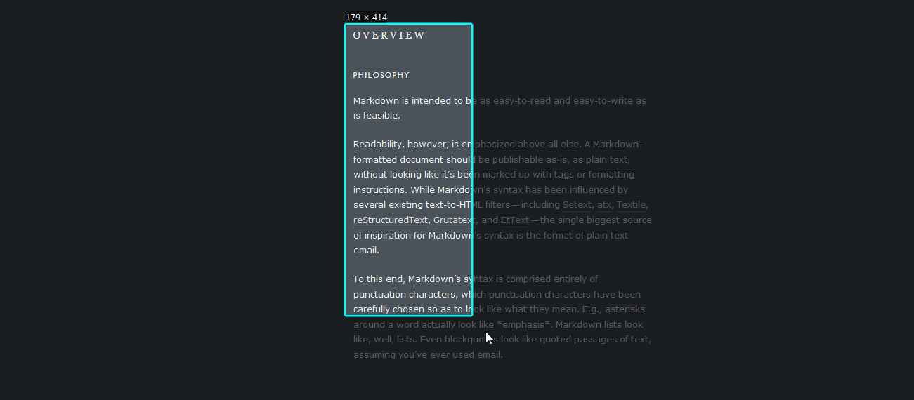

# ScreenShot（截屏贴图提高工作效率之神器）

***
##ScreenShot介绍
- 🔧 基于Qt5开发的windows截图工具，主要是参照Snipaste来做的，可以说是阉割版的Snipaste
- 🔧 同时也是桌面贴图工具，可贴图于桌面之上
##目录
- [主界面](#主界面)
- [功能介绍](#功能介绍)
- [亮点](#亮点)
- [License](#license)
##主界面
 
##功能介绍
###🔥查看图片
无边框桌面置顶显示，鼠标滚轮缩放图片

###🔥截图功能
全局热键截图，截图后鼠标中键可直接贴图于桌面之上

###🔥截图编辑功能
提供基本的画线面文字功能

###🔥提供语言配置

##亮点
当你没有多个屏幕显示的时候，可将需要的內容截屏贴图置于桌面一隅，方便快捷

## License

[MIT © ZypherChan.](../LICENSE)
